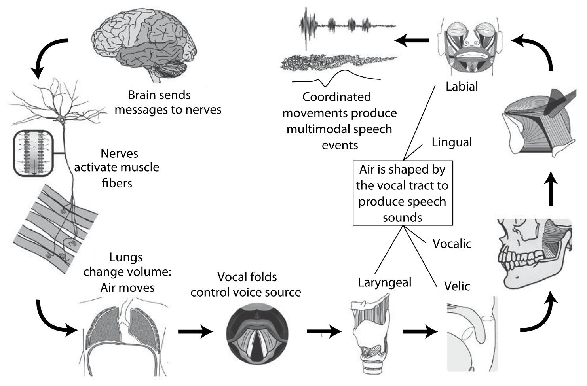
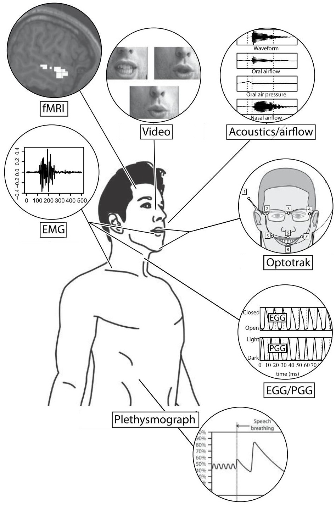
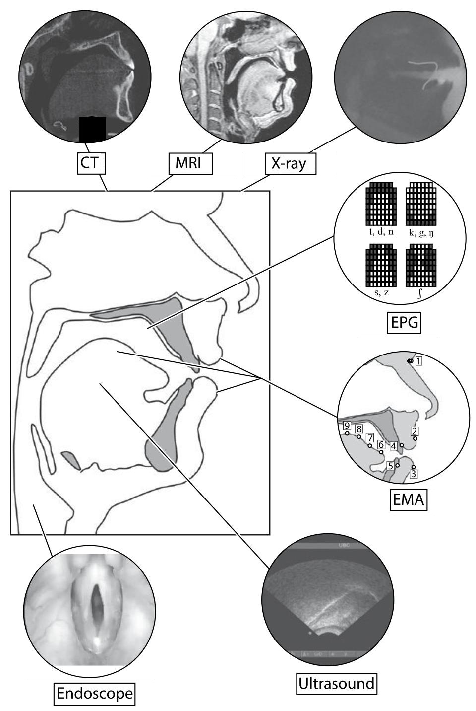
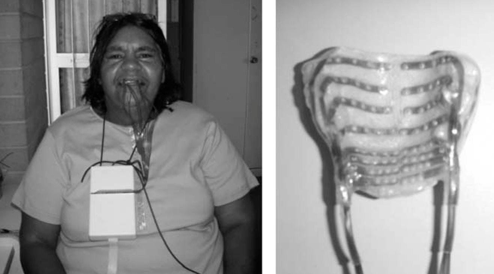
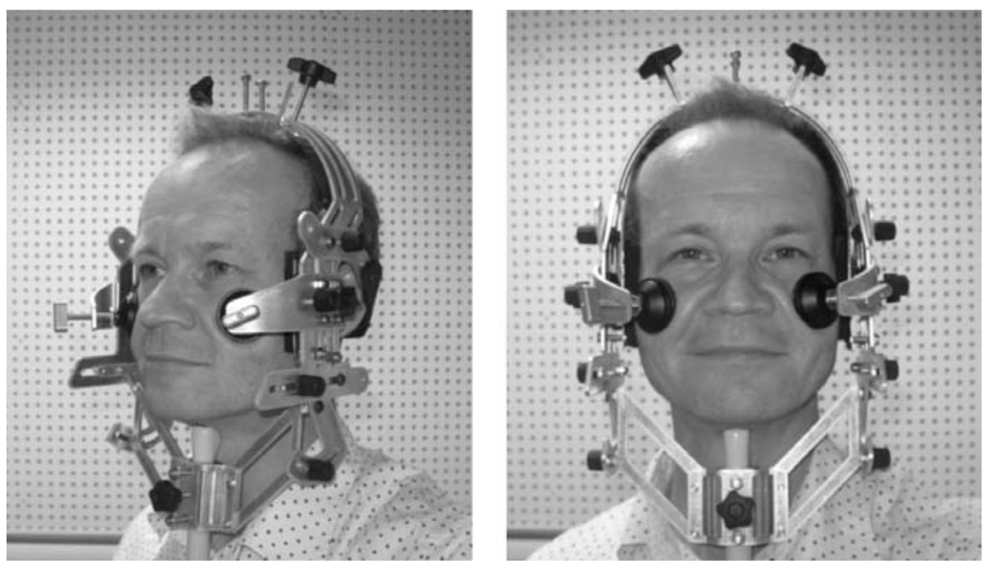
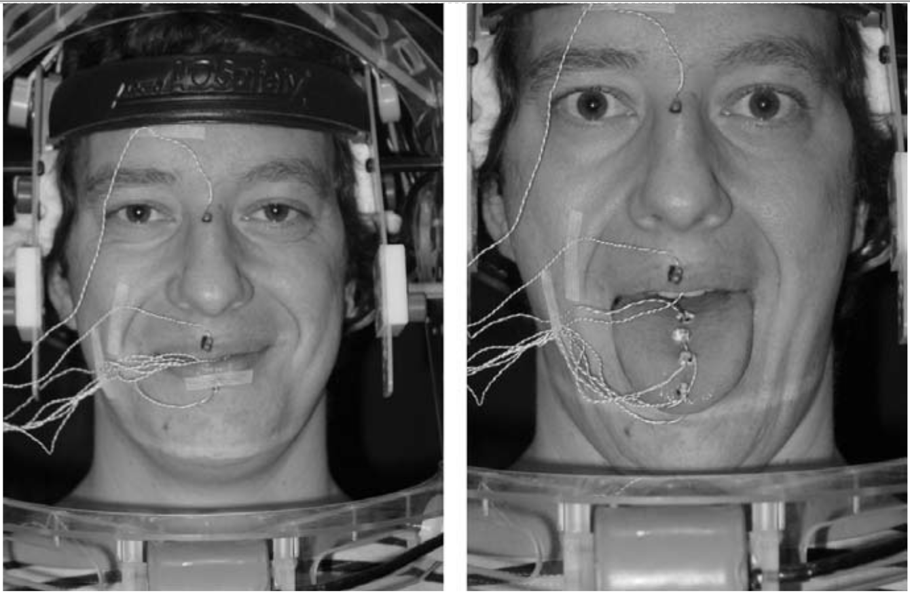

# Фрикативные, пакеты для R, методы исследования звука

```{r}
library(tidyverse)
theme_set(theme_bw())
```


## 1. Фрикативные 

* [fricatives](https://goo.gl/hvdviI), [fricatives' TextGrid](https://goo.gl/pza6tx), Extracted data: [ɬ](https://goo.gl/wo3QZN), [s](https://goo.gl/eNZQKa), [sh](https://goo.gl/NgeVSX), [x](https://goo.gl/oDYvbJ), [χ](https://goo.gl/vZQfZG) 

```{r, eval = FALSE}
# set your working directory ----------------------------------------------
setwd("...")

# read all files in the derictory to R ------------------------------------
myfiles  <- lapply(list.files(), read.delim)

# merge files into one dataframe ------------------------------------------
result_df <- Reduce(rbind, myfiles)

# create labels -----------------------------------------------------------
sounds <- c("l", "sh", "s", "x", "X")
result_df$label <- rep(sounds, sapply(myfiles, nrow))

# draw the plot -----------------------------------------------------------
library(ggplot2)
ggplot(data = result_df,
       aes(x = freq.Hz., 
           y = pow.dB.Hz., 
           color = label))+
  geom_line(size = 2)+
  theme_bw()+
  labs(title = "Smoothed LPC for different fricatives",
       x = "frequency (Hz)",
       y = "power (Db/Hz)")
```


## 3. Методы исследования артикуляционной фонетики









* Gick B., Wilson I. (2013) Articulatory Phonetics
* Jones M., Knight R.-A (2013) The Bloomsbury Companion to Phonetics

## 3. Пакеты для R

* Sueur J. (2018) Sound Analysis and Synthesis with R

### 3.1 `vowels`
```{r, eval=FALSE}
install.packages("vowels")
library(vowels)
```

Пакет для разных типов нормализации гласных: <http://lingtools.uoregon.edu/norm/>

### 3.2 `phonTools`
```{r, eval=FALSE}
install.packages("phonTools")
```

Много разных датасетов с гласными.

```{r}
library(phonTools)
data(t07)
t07 %>% 
  ggplot(aes(f2, f1, label = vowel, color = gender))+
  geom_text()+
  scale_x_reverse()+
  scale_y_reverse()+
  labs(subtitle = "Modeling L1/L2 interactions in the perception and production of English vowels by Mandarin L1 speakers", 
       caption = "Thomson, R. (2007)")

data(a96)
a96 %>% 
  ggplot(aes(f2, f1, label = vowel, color = sex))+
  geom_text()+
  scale_x_reverse()+
  scale_y_reverse()+
  labs(subtitle = "An acoustic analysis of modern Hebrew vowels and voiced consonants",
       caption = "Aronson et al. (1996)")
```


### 3.3 `phonfieldwork`

Пока мой пакет не загрузили на CRAN, его устанавливать нужно так:

```{r, eval=FALSE}
install.packages("devtools")
devtools::install_github("agricolamz/phonfieldwork")
library(phonfieldwork)
```

* `create_presentation()`
* `rename_soundfiles()`
* `concatenate_soundfiles()`
* `annotate_textgrid()`
* `extract_intervals()`
* `tier_to_df()` и `df_to_tier()`

## 4. Домашнее задание
### 4.1 Более простое
Вот [звук](https://github.com/agricolamz/2019_PhonDan/blob/master/data/andi_plosives.wav?raw=true) и [текстгрид](https://raw.githubusercontent.com/agricolamz/2019_PhonDan/master/data/andi_plosives.TextGrid). Извлеките при помощи скрипта Lennes M. длительность и визуализируйте при помощи [R скрипта](https://raw.githubusercontent.com/agricolamz/2019_PhonDan/master/data/plosives.R).

### 4.2 Более сложное
На флешке есть мои данные с абазинскими гласными и их разметкой. Воспользуйтесь [вот этим скриптом на гитхабе](https://github.com/agricolamz/get_pitch_formants_duration), чтобы извлечь форманты. Отфильтруйте полученные данные в R, чтобы остались только гласные a и ə. Постройте регрессию:

* предсказывающую f1 по типу гласного и длительносте
* предсказывающую f2 по типу гласного и длительносте

Помните про случайные эффекты.